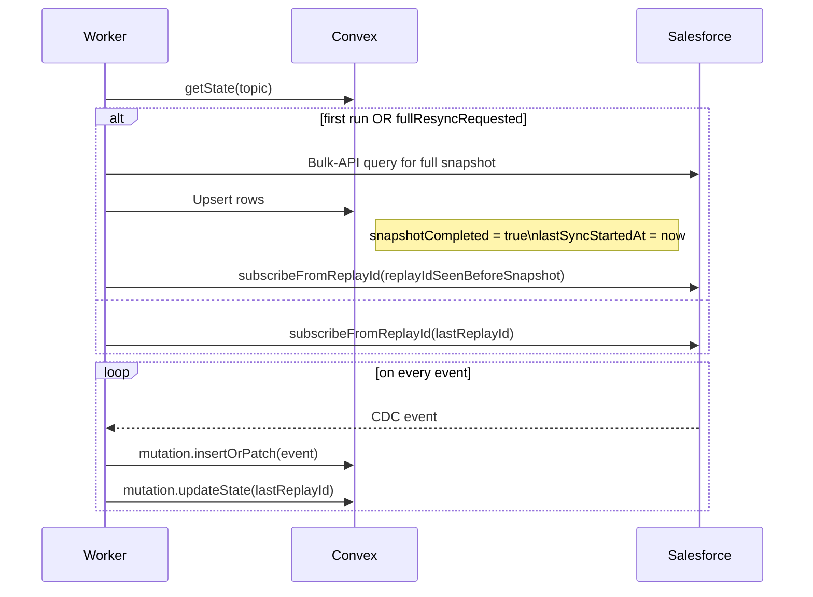

Below is a field‑tested blueprint that teams have used to run a **stand‑alone Node 20 + pnpm “CDC worker” Railway service** that

*authenticates to Salesforce Pub/Sub API*,
*streams Change Data Capture (CDC) events* with the **`salesforce‑pubsub‑api-client`** v5 library, and
*forwards each event into a **self‑hosted Convex** backend that is running in a second Railway service*.

---

## 1 Project topology on Railway

| Railway project    | Service                                              | Purpose                                                       | Key port/URL                                                             |
| ------------------ | ---------------------------------------------------- | ------------------------------------------------------------- | ------------------------------------------------------------------------ |
| **benefits‑stack** | **convex-backend** (Docker image supplied by Convex) | Self‑hosted database + function runtime                       | HTTP `4000` (you can pick a fixed port — see private‑network note below) |
|                    | **salesforce‑cdc‑worker** (Node 20 + pnpm)           | Long‑lived gRPC subscriber that relays CDC payloads to Convex | not publicly exposed                                                     |

*Both services are placed in the same Railway **private network**, so the worker can reach the backend at*
`http://convex-backend.railway.internal:4000` ([station.railway.com][1])

---

## 2 Convex backend (service A)

### 2.1 Container & port

* Follow Convex **self‑hosting guide** to build the `convex [version]` Docker image and expose port 4000. ([docs.convex.dev][2])
* In the service’s *Settings → Ports* set an **override** to `4000` so Railway doesn’t randomise it; that keeps the internal URL stable.

### 2.2 HTTP entry‑point for incoming events

Add an **HTTP action** so external callers can push JSON CDC events:

```ts
// convex/http.ts
import { httpRouter } from "convex/server";
import { recordCdcChange } from "./cdcActions";   // standard action/mutation you write

const http = httpRouter();

http.route({
  path: "/salesforce/cdc",
  method: "POST",
  handler: recordCdcChange,      // persists & triggers downstream logic
});

export default http;
```

HTTP actions are exposed automatically under
`https://<deployment>.convex.site/salesforce/cdc` and are fully type‑safe inside Convex. ([docs.convex.dev][3])

> **Self‑hosted quirk:** Because the worker talks over the private network, point it to `http://convex-backend.railway.internal:4000/salesforce/cdc` instead of the public `.convex.site` URL.

If you prefer not to open an HTTP action, you can hit the Convex **Functions HTTP API** (`/api/mutation`, `/api/action`) from the worker instead. ([docs.convex.dev][4])

---

## 3 salesforce‑cdc‑worker (service B)

### 3.1 Base image & pnpm caching

A minimal, reproducible Dockerfile that respects Railway’s build cache:

```Dockerfile
FROM node:20-alpine
RUN npm i -g pnpm

WORKDIR /app
COPY package.json pnpm-lock.yaml ./
RUN --mount=type=cache,id=pnpmstore,target=/root/.local/share/pnpm/store \
    pnpm install --frozen-lockfile            # very fast incremental builds

COPY . .
ENV PORT=8080   # not actually used, but keeps Railway happy
CMD ["pnpm","start"]
```

Using a separate cache mount for the **pnpm store** is the pattern recommended by other Railway Node + pnpm users to cut repeat build times by \~40 %. ([station.railway.com][5])

### 3.2 Environment variables (Railway *Secrets*)

Create the following secrets once with the CLI or dashboard ([station.railway.com][6]):

| Variable                   | Description                                                                      |
| -------------------------- | -------------------------------------------------------------------------------- |
| `SF_LOGIN_URL`            | usually `https://login.salesforce.com`                                           |
| `SF_CLIENT_ID`            | Connected‑app consumer key                                                       |
| `SF_CLIENT_SECRET`        | Connected‑app consumer secret                                                    |
| `SF_ORG_ID`               | Salesforce organization ID (optional but recommended for validation)            |
| `CDC_TOPICS`              | Comma‑separated list such as `/data/AccountChangeEvent,/data/ContactChangeEvent` |
| `CONVEX_BASE_URL`         | `http://convex-backend.railway.internal:4000`                                    |

Railway injects them at run‑time so **no secrets live in git**.

### 3.3 Subscriber implementation (TypeScript, v5 client)

```ts
import { PubSubApiClient } from "salesforce-pubsub-api-client";
import pino from "pino";
import fetch from "node-fetch";

const logger = pino();
const client = new PubSubApiClient({
  authType: "oauth-client-credentials",
  loginUrl: process.env.SF_LOGIN_URL!,
  clientId: process.env.SF_CLIENT_ID!,
  clientSecret: process.env.SF_CLIENT_SECRET!,
  organizationId: process.env.SF_ORG_ID  // Optional but recommended
}, logger);

await client.connect();

const topics = process.env.CDC_TOPICS!.split(",");
for (const topic of topics) {
  await client.subscribe(topic, async (sub, type, data) => {
    if (type === "event") {
      await fetch(`${process.env.CONVEX_BASE_URL}/salesforce/cdc`, {
        method: "POST",
        headers: { "content-type": "application/json" },
        body: JSON.stringify({ topic: sub.topicName, event: data })
      });
    }
    if (type === "lastEvent") {
      // throttle: request the next 100 events when ready
      client.requestAdditionalEvents(sub.topicName, 100);
    }
  }, 100);        // pull‑based flow control – start with 100 events
}
```

*Key points aligned with the Pub/Sub API design*:

* **OAuth 2.0 client credentials** flow is suitable for server-to-server integration without user interaction. ([developer.salesforce.com][7])
* The v5 client uses **synchronous callbacks** so events remain in order; you supply `requestAdditionalEvents` for back‑pressure. ([developer.salesforce.com][8])
* Platform returns rich gRPC error codes; surface them through Pino. ([developer.salesforce.com][9])

**Setup Requirements for Client Credentials Flow:**
* Your Salesforce Connected App must have the **Client Credentials** flow enabled
* The Connected App must be configured with a **Run-As User** for the client credentials flow
* The Run-As User needs appropriate permissions for Change Data Capture access

---

## 4 Private‑network connectivity checklist

1. **Enable “Private Networking”** for *both* services in Railway.
2. Give the Convex service a **fixed port** (e.g. 4000) instead of an auto‑assigned one. This avoids the “port is randomly assigned at runtime” confusion. ([station.railway.com][10])
3. In the worker, hit `convex-backend.railway.internal:4000` – the internal DNS name is automatically registered. ([station.railway.com][11])

If you ever expose Convex publicly as well, keep the **deploy key** and any admin HTTP endpoints behind Railway’s built‑in HTTP auth or an upstream proxy.

---

## 5 Operational concerns

| Topic                      | Recommendation                                                                                                                                                                                                      |
| -------------------------- | ------------------------------------------------------------------------------------------------------------------------------------------------------------------------------------------------------------------- |
| **Idempotency / replay**   | Persist `subscription.lastReplayId` in Convex (e.g. a table keyed by topic). On worker start call `subscribeFromReplayId` so missed events are replayed.                                                            |
| **Scaling**                | One worker can drive \~4 MB/s of change events. Spin up a second identical worker pointed at the same Convex endpoint and same managed subscription if you expect bursts; flow control prevents duplicate delivery. |
| **Zero‑downtime redeploy** | In Railway, set the worker’s **restart policy** to *“graceful”*; pub‑sub client’s `close()` method shuts down the gRPC stream cleanly, so no events are lost.                                                       |
| **Observability**          | Use Railway **Logs** tab for both services; Convex functions and HTTP actions show per‑invocation logs in the dashboard. ([docs.convex.dev][3], [docs.convex.dev][4])                                               |

---

## 6 Putting it all together

1. **Create** a new Railway project and add the two services.
2. **Push** your Dockerfiles / source, set secrets, enable private networking.
3. **Deploy**. The Convex service boots first; note the internal URL and add it to worker secrets.
4. Watch worker logs – once it prints
   `Connected to Pub/Sub API endpoint api.pubsub.salesforce.com:7443`
   you can update an Account in Salesforce and see the CDC JSON land in Convex instantly.

Following this layout you get:

* **Security** – all traffic stays inside Railway’s VPC; Salesforce auth is OAuth client credentials; secrets never leave the platform.
* **Rapid builds** – pnpm cache layers keep images small and redeploys under \~30 s. ([station.railway.com][12])
* **Type safety end‑to‑end** – Avro schemas in Pub/Sub, TypeScript in both worker and Convex.
* **No glue code** – you rely on `salesforce‑pubsub‑api-client` for gRPC plumbing and Convex HTTP actions for ingest, instead of bespoke WebSocket or Streaming API code.

That is the smallest surface‑area, fully managed path to keep your Convex database perfectly in sync with live Salesforce data changes.

[1]: https://station.railway.com/questions/how-do-i-use-private-networking-with-rai-65fa14c1?utm_source=chatgpt.com "How do I use private networking with railway generated ports"
[2]: https://docs.convex.dev/self-hosting "Self Hosting | Convex Developer Hub"
[3]: https://docs.convex.dev/functions/http-actions "HTTP Actions | Convex Developer Hub"
[4]: https://docs.convex.dev/http-api/ "Convex HTTP API | Convex Developer Hub"
[5]: https://station.railway.com/questions/add-caching-to-node-dockerfile-ba727db7 "Loading..."
[6]: https://station.railway.com/questions/setting-environment-variables-from-cli-3bf27092 "Loading..."
[7]: https://developer.salesforce.com/docs/platform/pub-sub-api/guide/intro.html?utm_source=chatgpt.com "Get Started | Pub/Sub API - Salesforce Developers"
[8]: https://developer.salesforce.com/docs/platform/pub-sub-api/guide/grpc-api.html?utm_source=chatgpt.com "Pub/Sub API as a gRPC API | Get Started - Salesforce Developers"
[9]: https://developer.salesforce.com/docs/platform/pub-sub-api/guide/handling-errors.html?utm_source=chatgpt.com "Handle Errors - Pub/Sub API - Salesforce Developers"
[10]: https://station.railway.com/questions/how-do-i-use-private-networking-with-rai-65fa14c1 "How do I use private networking with railway generated ports - Railway Help Station"
[11]: https://station.railway.com/questions/could-not-translate-hostname-postgres-ra-f7a9abd5?utm_source=chatgpt.com "Could not translate hostname postgres.railway.internal"
[12]: https://station.railway.com/questions/build-fails-with-unrecognized-protocol-c-341c4f5c?utm_source=chatgpt.com "Build fails with unrecognized protocol catalog: for latest PNPM"


Below is a practical pattern that adds **(1) initial “full‑table” seeding, (2) replay‑ID–based resumption, and (3) manual reset** to the Railway CDC‑worker you built earlier.
The design uses only the features already available in **`salesforce‑pubsub‑api-client` v5**, Convex functions, and Railway’s private network, so there is no custom transport or queue to maintain.

---

## 1 Data‑model additions in Convex

| Table          | Fields                                              | Purpose                                                                                           |                                                                                                                                                          |
| -------------- | --------------------------------------------------- | ------------------------------------------------------------------------------------------------- | -------------------------------------------------------------------------------------------------------------------------------------------------------- |
| `cdcSyncState` | `topicName :string` (PK) • \`lastReplayId \:number  | null`•`snapshotCompleted \:boolean`•`lastSyncStartedAt \:number`•`fullResyncRequested \:boolean\` | Persists exactly **one row per CDC topic** so the worker can restart idempotently. Convex auto‑creates the table on first insert. ([docs.convex.dev][1]) |

Create a **mutation** `internal.cdc.updateState` that upserts this record and an **action/query** `internal.cdc.getState` that returns it. Convex actions can both read and write and are perfect for small control‑plane calls. ([docs.convex.dev][2])

---

## 2 Boot sequence for the worker



### 2.1 Fetch sync‑state

The worker starts by calling `GET http://convex-backend.railway.internal:4000/cdc/state?topic=…` (an HTTP Action) to retrieve `cdcSyncState`. ([docs.convex.dev][3], [docs.railway.com][4])

### 2.2 Take a **full snapshot** when needed

*If* `snapshotCompleted` is `false` **or** `fullResyncRequested` is `true`, the worker runs a Bulk/Composite REST query for the base object (Account, Contact, …) and upserts every row through a Convex mutation. You can throttle this with Convex **actions**, which allow up to 10 minutes of external fetch time. ([docs.convex.dev][2], [docs.convex.dev][5])

**Capturing a safe starting Replay ID**

1. Open a short‑lived Pub/Sub subscription with `numRequested = 1`.
2. Read the first (latest) event header and store its `replayId`.
3. Close the stream.
4. Run the full export.
5. After the export finishes, call `subscribeFromReplayId(topic, cb, null, capturedReplayId)` so that all events that happened *during* the export are replayed. The Streaming/CDC durability docs describe this pattern. ([developer.salesforce.com][6], [developer.salesforce.com][7])

### 2.3 Normal restart path

If a previous `lastReplayId` exists and no resync is pending, call:

```ts
await client.subscribeFromReplayId(topic, cb, undefined, lastReplayId);
```

The Pub/Sub service delivers every change **after** that ID, provided it is still in the 72‑hour retention window. ([developer.salesforce.com][7])

---

## 3 Event callback with replay tracking

```ts
const cb: SubscribeCallback = async (sub, type, data) => {
  switch (type) {
    case "event":
      await fetch(`${BASE}/cdc/upsert`, { method:"POST", body: JSON.stringify(data)});
      // Persist state every N events
      if (sub.receivedEventCount % 50 === 0) {
        await fetch(`${BASE}/cdc/state`, {
          method:"POST",
          body: JSON.stringify({ topic: sub.topicName, lastReplayId: data.replayId })
        });
        // (optional) commit on managed subscription
        client.commitReplayId(sub.subscriptionId!, data.replayId);
      }
      break;
    case "lastEvent":
      client.requestAdditionalEvents(sub.topicName, 100);  // flow control
      break;
  }
};
```

* `commitReplayId` lets Salesforce hold the pointer server‑side when you use **Managed Event Subscriptions**. ([developer.salesforce.com][8])
* Flow‑control with `requestAdditionalEvents` prevents overload. ([developer.salesforce.com][9])

---

## 4 Manual “reset” switch

Expose an **admin mutation** or dashboard button that sets `fullResyncRequested = true`.
The worker polls `getState()` every few minutes (or receives it via a Convex Scheduler push) and triggers the snapshot procedure again. Because state lives in Convex, **no restart of the Railway container is required**.

---

## 5 Environment & deployment notes on Railway

| Need               | Setting                                                                                                                                                                                                                                           |
| ------------------ | ------------------------------------------------------------------------------------------------------------------------------------------------------------------------------------------------------------------------------------------------- |
| Secret storage     | Add client ID, client secret, etc. under **Variables** in the worker service; Railway injects them into both build & runtime. ([docs.railway.com][10])                                                                                           |
| Private traffic    | Enable **Private Networking** on *both* services and call `http://convex-backend.railway.internal:<port>` from the worker. Internal DNS resolves to IPv6 only; be sure Convex listens on `::`. ([docs.railway.com][4], [station.railway.com][11]) |
| Graceful redeploy  | Railway sends SIGTERM; call `client.close()` so no event is lost.                                                                                                                                                                                 |
| Replay‑window gaps | If the worker has been down > 72 h, the next start sees `lastReplayId` rejected: detect gRPC status 9 = `OUT_OF_RANGE` and flip `fullResyncRequested` automatically. ([developer.salesforce.com][7])                                              |

---

## 6 Why this satisfies the requirements

* **Replay after restarts** – `lastReplayId` is stored atomically with each batch and fed back to `subscribeFromReplayId`, matching Salesforce best‑practice docs. ([developer.salesforce.com][12], [developer.salesforce.com][7])
* **Initial and repeat full syncs** – snapshot flag ensures CDC events are buffered and applied *after* the base data is in Convex, giving you a consistent starting state.
* **Manual reset** – a single boolean field toggled through Convex’s own dashboard or API.
* **No extra services** – all persistence lives in Convex; all transport is either Pub/Sub gRPC or HTTP over Railway’s private mesh.

Implementing these pieces yields a resilient pipeline that can bootstrap fresh environments, survive redeploys, and recover from long outages while keeping your Convex data store faithfully mirrored to Salesforce.

[1]: https://docs.convex.dev/llms.txt "docs.convex.dev"
[2]: https://docs.convex.dev/functions/actions "Actions | Convex Developer Hub"
[3]: https://docs.convex.dev/functions/http-actions "HTTP Actions | Convex Developer Hub"
[4]: https://docs.railway.com/guides/private-networking "Private Networking | Railway Docs"
[5]: https://docs.convex.dev/functions/actions?utm_source=chatgpt.com "Actions | Convex Developer Hub"
[6]: https://developer.salesforce.com/docs/atlas.en-us.change_data_capture.meta/change_data_capture/cdc_subscribe_delivery.htm?utm_source=chatgpt.com "Change Event Storage and Delivery - Salesforce Developers"
[7]: https://developer.salesforce.com/docs/atlas.en-us.api_streaming.meta/api_streaming/using_streaming_api_durability.htm?utm_source=chatgpt.com "Message Durability | Streaming API Developer Guide"
[8]: https://developer.salesforce.com/docs/platform/pub-sub-api/guide/managed-sub.html?utm_source=chatgpt.com "Managed Event Subscriptions (Beta) | Use Pub/Sub API"
[9]: https://developer.salesforce.com/docs/atlas.en-us.change_data_capture.meta/change_data_capture/cdc_allocations.htm?utm_source=chatgpt.com "Change Data Capture Allocations - Salesforce Developers"
[10]: https://docs.railway.com/guides/variables "Using Variables | Railway Docs"
[11]: https://station.railway.com/questions/internal-ur-ls-not-working-cb48c94f "internal URLs not working - Railway Help Station"
[12]: https://developer.salesforce.com/docs/atlas.en-us.change_data_capture.meta/change_data_capture/cdc_replication_steps.htm?utm_source=chatgpt.com "Transaction-Based Replication Steps | Change Data Capture ..."


Below is a gap‑analysis of the **Convex side** of your Salesforce → Convex pipeline.
For each area I list the concrete artefacts that still need to be designed or implemented, explain why they matter, and link to the relevant Convex primitives so you can navigate the docs quickly.

---

## 1  Schema & Data‑model work

### 1.1 Tables for base objects

* Create one table per CDC topic (`accounts`, `contacts`, …) plus a **mapping table** that relates the 18‑char Salesforce ID to your Convex `_id` (helps when a record is deleted or merged).
* Define the column types in `schema.ts` and run `npx convex codegen` so the worker and any UI enjoy compile‑time safety. ([docs.convex.dev][1], [docs.convex.dev][2])

### 1.2 Sync‑state table (already sketched)

* Add secondary fields: `bulkJobId`, `bulkJobStatus`, `errorCount` to surface Bulk‑API progress in the dashboard.
* Put an **index on `{topicName, lastReplayId}`**; this is queried at each worker start, so avoid a full‑table scan. ([docs.convex.dev][3], [docs.convex.dev][3])

### 1.3 Indexes for your read paths

* Any UI or downstream job that filters by Salesforce ID or `UpdatedDate` should use `withIndex` to stay under Convex read limits once tables grow. ([docs.convex.dev][4], [docs.convex.dev][5])

### 1.4 Validation & coercion

* Attach `v.object({...})` validators to each mutation so bad payloads from Salesforce are rejected early. ([docs.convex.dev][1])

---

## 2  Function surface

| Function kind                  | Purpose                                               | Notes                                                                                                                                                                                     |
| ------------------------------ | ----------------------------------------------------- | ----------------------------------------------------------------------------------------------------------------------------------------------------------------------------------------- |
| **`mutation.cdc.upsert`**      | Insert/update a single CDC event atomically.          | Wrap all field assignments in one transaction so re‑ordering can’t corrupt state. 💡Use optimistic concurrency; Convex will retry on write‑conflict automatically. ([docs.convex.dev][6]) |
| **`action.cdc.bulkLoad`**      | One‑off full snapshot via Salesforce Bulk API.        | Runs up to 10 min; chunk the CSV/JSON feed into `scheduler.runAfter` batches to stay within action RAM. ([docs.convex.dev][7], [docs.convex.dev][8])                                      |
| **`mutation.cdc.updateState`** | Persist `lastReplayId`, toggle `fullResyncRequested`. | Called by the worker every *N* events.                                                                                                                                                    |
| **`query.cdc.getState`**       | Read sync status for a topic.                         | Used by worker and dashboard.                                                                                                                                                             |

Add **HTTP actions** that proxy to these internal calls so the Railway worker remains decoupled from Convex internals. ([docs.convex.dev][9])

---

## 3  Scheduling & cron

* **Bulk import continuation** – Schedule the next `action.cdc.bulkLoad` slice with `scheduler.runAfter`. ([docs.convex.dev][7], [docs.convex.dev][8])
* **Stale replay detection** – A daily cron checks whether the latest `lastReplayId` is older than 70 h (CDC retention = 72 h) and, if so, flips `fullResyncRequested=true`. ([docs.convex.dev][10], [docs.convex.dev][11])
* **Data hygiene** – Optional cron to purge archived Salesforce rows or compress file attachments.

You can view/kill scheduled runs in the dashboard’s **Schedules** tab. ([docs.convex.dev][12])

---

## 4  Access control & security

* Protect every HTTP action with a shared secret header or Convex **Auth** JWT so only the Railway worker may call it. ([docs.convex.dev][13], [docs.convex.dev][14])
* Define a *role* (e.g. `systemWorker`) and gate mutations with `ctx.auth.getUserIdentity()` checks; throw `ConvexError('unauthorized')` otherwise. ([docs.convex.dev][15])
* Use **Team / Project roles** so human admins have read‑only access in prod while keeping write rights in dev. ([docs.convex.dev][16])

---

## 5  Observability & error handling

* Wrap every mutation/action in `try / catch` and re‑throw `ConvexError` with `data` payload for structured logging. ([docs.convex.dev][15])
* Stream Convex logs to Railway’s **Logs** tab with `npx convex logs --prod` during incidents.
* Emit custom metrics by writing to a `cdcMetrics` table; front‑end dashboards can subscribe in real time.

---

## 6  Backup, import & schema evolution

* Enable nightly **backups** in the Convex dashboard; store snapshots in Railway object storage or download via CLI. ([docs.convex.dev][17])
* When Salesforce adds fields, append columns in `schema.ts`; Convex auto‑migrates existing docs.
* For dev/QA, seed from production via **export → import** commands or the Airbyte connector. ([docs.convex.dev][18])

---

## 7  Testing & local development

1. Use **`npx convex dev`** with a local Dockerised PostgreSQL to run Convex offline. ([docs.convex.dev][19])
2. Write Jest tests that call `runMutation` directly against the dev deployment to verify upsert logic.
3. Load canned CDC JSON fixtures and assert the state of target tables.

---

## 8  Readiness checklist

* [ ] Tables & schema (including mapping + indexes)
* [ ] Validators in every mutation/action
* [ ] Upsert, bulk‑load, state and admin functions implemented
* [ ] HTTP actions secured with JWT/secret
* [ ] Scheduler & cron jobs registered
* [ ] Backup policy turned on
* [ ] Dashboard panel or query showing *sync health* (lag minutes, lastReplayId)
* [ ] Jest/Playwright end‑to‑end test covering a CDC event replay

Completing these items will give you a fully self‑contained Convex backend that **bootstraps, resumes with replay IDs, recovers from long outages, and surfaces health metrics**—all while staying inside the patterns recommended by Convex’s own best‑practice guides.

[1]: https://docs.convex.dev/functions/validation?utm_source=chatgpt.com "Argument and Return Value Validation | Convex Developer Hub"
[2]: https://docs.convex.dev/functions/query-functions?utm_source=chatgpt.com "Queries | Convex Developer Hub"
[3]: https://docs.convex.dev/database/reading-data/indexes/?utm_source=chatgpt.com "Indexes | Convex Developer Hub"
[4]: https://docs.convex.dev/database/reading-data/indexes/indexes-and-query-perf?utm_source=chatgpt.com "Introduction to Indexes and Query Performance - Convex Docs"
[5]: https://docs.convex.dev/database/reading-data/filters?utm_source=chatgpt.com "Filters | Convex Developer Hub"
[6]: https://docs.convex.dev/error?utm_source=chatgpt.com "Errors and Warnings | Convex Developer Hub"
[7]: https://docs.convex.dev/api/interfaces/server.Scheduler?utm_source=chatgpt.com "Interface: Scheduler | Convex Developer Hub"
[8]: https://docs.convex.dev/scheduling/scheduled-functions?utm_source=chatgpt.com "Scheduled Functions | Convex Developer Hub"
[9]: https://docs.convex.dev/functions/http-actions?utm_source=chatgpt.com "HTTP Actions | Convex Developer Hub"
[10]: https://docs.convex.dev/scheduling/cron-jobs?utm_source=chatgpt.com "Cron Jobs | Convex Developer Hub"
[11]: https://docs.convex.dev/scheduling?utm_source=chatgpt.com "Scheduling | Convex Developer Hub"
[12]: https://docs.convex.dev/dashboard/deployments/schedules?utm_source=chatgpt.com "Schedules | Convex Developer Hub"
[13]: https://docs.convex.dev/auth?utm_source=chatgpt.com "Authentication | Convex Developer Hub"
[14]: https://docs.convex.dev/auth/functions-auth?utm_source=chatgpt.com "Auth in Functions | Convex Developer Hub"
[15]: https://docs.convex.dev/functions/error-handling/application-errors?utm_source=chatgpt.com "Application Errors | Convex Developer Hub"
[16]: https://docs.convex.dev/dashboard/teams?utm_source=chatgpt.com "Teams | Convex Developer Hub"
[17]: https://docs.convex.dev/database/backup-restore?utm_source=chatgpt.com "Backup & Restore | Convex Developer Hub"
[18]: https://docs.convex.dev/database/import-export/?utm_source=chatgpt.com "Data Import & Export | Convex Developer Hub"
[19]: https://docs.convex.dev/cli?utm_source=chatgpt.com "CLI | Convex Developer Hub"


Got it. I’ll review the code in the `components/` and `convex-helpers/` directories and show you how the existing modules—`action-retrier`, `rate-limiter`, `workflow`, and `workpool`—can be applied to the CDC pipeline and Convex integration to improve reliability and maintainability. I’ll follow up with a detailed breakdown shortly.


# Integrating Convex Workflow, Retries, Rate Limiting, and Workpools in the Salesforce CDC Pipeline

In this architecture, a Node.js **Salesforce CDC worker** streams Change Data Capture events from Salesforce and pushes them to a **Convex backend** via HTTP. On the Convex side, we want to ingest these events reliably and manage background sync tasks. We’ll incorporate Convex’s helper components – **Workflow**, **ActionRetrier**, **RateLimiter**, and **Workpool** – to achieve a robust, observable, and simple ingestion pipeline. Below we outline how to wire each module into Convex functions (mutations/actions) and how the external worker should interact with them.

## Convex Workflows for Multi-Step Sync and Snapshots

For one-time or long-running processes like **initial full sync bootstrapping** or **manual resets**, the Convex **Workflow** component is ideal. A Convex workflow lets us sequence multiple steps (queries, mutations, actions) in a durable, fault-tolerant manner. Each step can have its own retry policy, and workflows can span long durations (even months) and survive server restarts. We will use a workflow to coordinate a multi-step **snapshot ingestion**:

* **Defining a Workflow:** In your Convex backend, install the workflow component and create a `WorkflowManager` in `convex/index.ts`. For example:

  ```ts
  // convex/index.ts
  import { WorkflowManager } from "@convex-dev/workflow";
  import { components } from "./_generated/api";
  export const workflow = new WorkflowManager(components.workflow);
  ```

  Then define a workflow for the full sync process. The workflow’s handler function will orchestrate the steps of fetching and ingesting data for each Salesforce object/topic. For instance:

  ```ts
  export const fullSyncWorkflow = workflow.define({
    args: { topics: v.array(v.string()) },  // e.g. list of CDC topics or object types to sync
    handler: async (step, args): Promise<void> => {
      // Loop through each topic/object type sequentially
      for (const topic of args.topics) {
        // Step 1: fetch all records for this topic from Salesforce and insert into Convex
        await step.runAction(internal.cdc.fetchAllRecords, { topic });
      }
      // (Additional steps or cleanup can be added here)
    },
  });
  ```

  In this example, `fetchAllRecords` would be a Convex *action* that handles pulling a full dataset for one object (perhaps by paging through the Salesforce API) and writing it to Convex. By calling it via `step.runAction`, the workflow ensures the step is executed *asynchronously* and will resume the workflow only when that action completes. If one step fails, the workflow can be configured to retry it (more on retry below). We call each topic sequentially in the loop above for simplicity, but **Convex workflows also support parallel steps** – you could fire off multiple `step.runAction` calls in a `Promise.all` if you want to fetch multiple objects in parallel. This parallelism would speed up the sync but be mindful of API rate limits (we’ll address that with the rate limiter).

* **Workflow Retries and Determinism:** To handle transient failures during the sync (e.g. a Salesforce API call times out), enable retry logic in the workflow. By default, a workflow will *fail* if any step’s action throws, with no automatic retries. We can change this by providing a retry policy. For example, when initializing the `WorkflowManager`, set a default retry behavior for actions:

  ```ts
  export const workflow = new WorkflowManager(components.workflow, {
    defaultRetryBehavior: { maxAttempts: 3, initialBackoffMs: 5000, base: 2 },
    retryActionsByDefault: true,
  });
  ```

  This would globally retry any failed action up to 3 times with exponential backoff. You can also override the policy per step: for instance, `step.runAction(..., { retry: { maxAttempts: 5, initialBackoffMs: 1000, base: 2 } })` to give a specific step a custom retry schedule. Conversely, if a particular step should *not* retry (e.g. a non-idempotent operation), you can pass `{ retry: false }` to that `runAction` call. Each workflow step should be **deterministic** (no random timers or non-repeatable side effects) so that if it does retry or resume after a crash, it produces the same outcome. In practice, this means most of the work should happen inside the called Convex functions (which themselves can have randomness or external calls), not in the workflow handler’s local logic.

* **Snapshot Ingestion Steps:** The `fetchAllRecords` action mentioned above will likely need to break down the data retrieval into pages or chunks if the object has many records. One approach is to perform a loop *within* that action, calling the Salesforce API to fetch a batch of records, writing them to Convex, then continuing until done. If that single action might run too long or risk hitting memory limits, an alternative is to use the workflow to sequence the pages as separate steps. For example, the workflow could repeatedly call a smaller action that fetches the next page and stores it, until all pages are done. You might implement this by returning a pagination cursor from one step and having the workflow loop or recursively call the next step until completion. The Convex workflow API allows scheduling future steps, but a simpler approach is often to perform the paging loop inside one action if possible (since Convex actions can run a few seconds and handle moderate data sizes). In either case, make sure to use the **RateLimiter** (discussed below) to avoid exceeding Salesforce API quotas during a full sync, and leverage the **ActionRetrier** for any individual API call that might fail.

* **Monitoring and Completion:** The workflow will run asynchronously (in the background) once started. You can start it from a Convex mutation or action, for example an admin mutation like:

  ```ts
  export const initiateFullSync = mutation({
    handler: async (ctx) => {
      await workflow.start(ctx, internal.cdc.fullSyncWorkflow, { topics: ALL_CDC_TOPICS });
    },
  });
  ```

  This returns a `workflowId` which you can store or use to check status. You can query the workflow’s status reactively (e.g. via a Convex query or by polling `workflow.status()` in an action) to observe progress. It will show whether the workflow is in progress or completed (and you can even subscribe to this in a client if needed for a dashboard). Consider using an `onComplete` callback for the workflow if you need to run some finalization code when the full sync finishes – for example, you might insert a record in Convex like `{ syncCompletedAt: ... }` or notify the system that it can now begin normal CDC processing. The onComplete is a Convex *mutation* that you specify when calling `workflow.start` (with an optional context object); it will be invoked exactly once when the workflow ends, whether successfully or with an error. This is a good place to handle success vs. failure of the full sync (e.g. log an error if the workflow ultimately failed after retries).

* **Cancellation and Resets:** In case you need to **abort** an ongoing sync (manual reset scenario), you can call `workflow.cancel(ctx, workflowId)` from an action or mutation. This will stop scheduling new steps and prevent further progress (though any action currently mid-execution will finish). After cancellation or completion, you might also call `workflow.cleanup(ctx, workflowId)` to remove the workflow’s stored state from the Convex database (workflows keep their state for some time by default). For a **manual reset** procedure, an operator could trigger a cancellation of any running workflow and perhaps run a special Convex mutation to clear existing data or reset offsets, then start a new `fullSyncWorkflow` to rebuild state. All these operations (start, cancel, cleanup) should be exposed via Convex functions that an admin tool or the worker can call. This ensures the logic lives in the Convex backend, maintaining atomicity and consistency of state when resetting.

Using a Convex workflow for bootstrapping ensures **robustness** (it will keep trying until it completes, and survive interruptions), **observability** (you can track its status and each step’s result in logs or via `workflow.status()`), and **operational simplicity** (one trigger starts an entire multi-step process, as opposed to needing a complex external script). We offload the heavy lifting of the initial sync to Convex, where we can tightly control pace and error handling.

## ActionRetrier for Transient Error Handling

Salesforce API calls or other side-effects can fail sporadically – e.g. a network glitch, a Convex function hitting a temporary issue, or the Convex backend restarting during an action. To **gracefully handle transient errors**, we can use the **Action Retrier** component. This provides a simple mechanism to run a Convex action with automatic retries and exponential backoff until it succeeds (or a max retry count is hit).

**Wiring the ActionRetrier:** After installing `@convex-dev/action-retrier`, initialize it in your Convex backend (e.g. in `convex/index.ts`) as shown in the docs:

```ts
import { ActionRetrier } from "@convex-dev/action-retrier";
import { components } from "./_generated/api";
export const retrier = new ActionRetrier(components.actionRetrier);
```

By default this uses a maximum of 4 attempts with exponential backoff, but you can configure the parameters (initial delay, backoff base, maxFailures) if needed. To **run** an action through the retrier, use `await retrier.run(ctx, internal.yourModule.yourAction, args)`. For example, if `processEvent` is implemented as a Convex *action*, you might choose to call it via the retrier instead of directly:

```ts
export const recordCdcChange = action(async (ctx, { topic, event }) => {
  // Instead of calling processEvent directly, run it via the retrier:
  const runId = await retrier.run(ctx, internal.cdc.processEvent, { topic, event });
  // (Optional) store runId or do something; typically just return success status
});
```

Here, `recordCdcChange` is the HTTP handler action invoked by the worker (more on that in the Workpool section). We pass the incoming event to `retrier.run`. The retrier will immediately start `processEvent` and, if it throws an error, automatically schedule retries with backoff, up to 4 total tries. The `runId` we get back is an identifier for the retrier job – we can ignore it if we don’t need to track the result synchronously. The retried action runs in the background; `retrier.run` does **not** wait for the action to finish (so our HTTP request from the worker can return a success response as soon as the event is accepted for processing). If needed, you can later query the status or result via `retrier.status(ctx, runId)` or attach an `onComplete` callback to handle the final outcome once it’s done.

**When to use ActionRetrier:** This component is most useful for *idempotent* actions that may fail due to temporary conditions. A prime example is any Convex action that calls out to Salesforce (or another API). Suppose `processEvent` sometimes calls Salesforce’s REST API to fetch additional details and that call can time out. We could wrap just that external call in a try-catch and retry loop manually, but using the Convex retrier has advantages: it persists the retry schedule in the Convex backend and won’t be disrupted by server restarts. Another scenario is a Convex action that performs some complex logic and occasionally hits a transient Convex error (like an Optimistic Concurrency Control conflict or a temporary database unavailability). Retrying the whole action can often succeed on the second try. By using the ActionRetrier, you let Convex handle the backoff and retry timing outside of the request cycle.

**Idempotency Requirement:** It’s critical that any action you retry is *safe to run multiple times*. This typically means that running it more than once has the same effect as running it once, or at least does not cause harmful side-effects if repeated. For example, if an action is inserting a record into a Convex table, you should design it to upsert or check for existing data rather than blindly insert duplicates each time. The Convex docs note that you should ensure each step involving third-party APIs is idempotent (e.g. provide unique IDs to external operations so that a retry isn’t processed twice by the external service). In our CDC pipeline, **processing a given event** should ideally be idempotent – since Salesforce events have unique IDs or replay IDs, you can use those to prevent duplicate application. For instance, you might store the last processed replay ID for each object and ignore an event if it’s equal or older than the stored one (ensuring a retried event doesn’t double-apply changes). Designing `processEvent` with idempotency in mind will make both retrier and workpool retries safe.

**Combining with Workflow or Workpool:** If you adopt the **Workpool** (next section) to queue event processing, you may not need to call the ActionRetrier directly for those events – the Workpool itself can handle retries (and in fact uses similar backoff strategy under the hood). However, you might still use ActionRetrier for other parts of your system or for specific calls. For example, inside the full sync workflow, if you have a step that calls a *Salesforce data export* action, you could use the workflow’s retry mechanism or even call `retrier.run` on a sub-action that fetches data. There is some overlap in capabilities: workflows and workpools have built-in retry options, but the ActionRetrier is a simpler abstraction if you just need to reliably execute one action at a time. It could be useful in scenarios outside of the main CDC event flow (or if you choose not to use a workpool for events, you could use ActionRetrier to at least retry the event action a few times).

In summary, **use the ActionRetrier for any Convex actions that interface with unreliable external systems or that you expect might fail transiently**, especially if you want those retries to happen asynchronously and not block the client. This helps achieve robustness: the system will *eventually* succeed in processing an event or API call without manual intervention, as long as the issue is temporary. For logging and observability, you can provide an `onComplete` mutation to log success or failure of a retried action once it gives up, ensuring that permanent failures are visible for operators.

## Rate Limiting to Honor Convex and Salesforce Limits

Both Convex and Salesforce impose limits that we must respect for a healthy system. Convex (when self-hosted or on a plan) has practical limits on write throughput, and Salesforce APIs have strict quotas (e.g. API calls per 24 hours, or requests per second). Our ingestion pipeline should throttle itself to stay within these bounds. The Convex **RateLimiter** component provides a declarative way to enforce **application-level rate limits** on function calls. We’ll use it in two ways:

1. To avoid overloading the Convex backend with too many write operations in a short time (especially during bursts of CDC events).
2. To throttle calls to Salesforce from Convex (such as during full sync or any event-driven fetches), ensuring we don’t exceed Salesforce’s quotas.

**Setting up RateLimiter:** After adding `@convex-dev/rate-limiter`, instantiate a `RateLimiter` in Convex (similar to other components). Typically you do this in the module where you want to apply limits. For example, in a file `convex/cdcLimits.ts` you might have:

```ts
import { RateLimiter, MINUTE } from "@convex-dev/rate-limiter";
import { components } from "./_generated/server";  // using server export for RateLimiter
export const rateLimiter = new RateLimiter(components.rateLimiter, {
  // Define one or more named limits:
  ingestEvents: {
    // e.g. allow 50 events per minute with bursts up to 100
    kind: "token bucket",
    rate: 50,
    period: MINUTE,
    capacity: 100,
  },
  salesforceQueries: {
    // e.g. global SF API call limit: 100 calls per minute (sharded to distribute load)
    kind: "fixed window",
    rate: 100,
    period: MINUTE,
    shards: 5,  // sharding can improve throughput in high-scale scenarios
  },
});
```

This configuration (illustrative numbers) defines two rate limits: `ingestEvents` uses a **token bucket** strategy (smooth out bursts by allowing up to 100 events at once if unused tokens accumulated, refilling at 50 per minute), and `salesforceQueries` uses a **fixed window** (hard cap of 100 per minute across the system, distributed across 5 shards for concurrency). The token bucket is well-suited for user-driven or bursty traffic (it allows short bursts and then throttles to a steady rate), whereas fixed window is straightforward for a global cap. You can adjust these values to match your exact Convex capacity and Salesforce org limits – for example, if Salesforce allows 10k API calls per day (\~7 per minute on average), you might set a fixed window of say 1000 per hour, etc.

**Applying the Rate Limits in Convex functions:** Once the `RateLimiter` is configured, you need to invoke it in the functions that should be limited. The RateLimiter provides methods (e.g. often named something like `check` or `take`) to consume a token or ensure the call is within limits. In our case:

* In the **event ingestion path** (the HTTP endpoint handler or wherever `recordCdcChange` logic runs), call the rate limiter at the start to enforce `ingestEvents`. For example:

  ```ts
  export const recordCdcChange = action(async (ctx, { topic, event }) => {
    await rateLimiter.limit(ctx, "ingestEvents");  // pseudo-method: use actual RateLimiter API
    // proceed to enqueue or process the event...
  });
  ```

  The exact method name may differ (`limit`, `take`, etc.), but the concept is to tell the rate limiter “this counts as one event ingestion; throw if we’re over the rate”. If the limit is not exceeded, execution continues. If the rate is exceeded, the RateLimiter will **throw a Convex error** indicating the limit has been hit. Specifically, it throws an error with `error.data.kind === "RateLimited"`, providing the name of the limit and a suggested `retryAfter` duration. Convex will fail the function call in that case.
* In the **Salesforce API call actions** (like the `fetchAllRecords` or any action that queries Salesforce), use the rate limiter for `salesforceQueries`. For instance, before making an outbound REST call, do `await rateLimiter.limit(ctx, "salesforceQueries")`. This ensures you don’t initiate more than the allowed calls in the defined window. If you expect multiple calls inside one action, you might call the limiter for each call or potentially configure the limit as a token bucket that allows a burst of a few calls in quick succession (depending on how your action is structured). It’s important that this limit is coordinated with any calls the Node worker itself might make – in our design, the Node worker’s Salesforce interactions are just the Pub/Sub stream, and we’re handling additional queries from Convex side, so the Convex should enforce its own limits for those queries.

**Effect on the Worker:** When Convex rate-limits a request (say the events are coming in too fast), the `recordCdcChange` action will throw an error which translates to a non-200 HTTP response. The worker needs to handle this gracefully. The RateLimiter sets a `retryAfter` in the error data; Convex’s HTTP API likely returns a 429 status or a 400 with that info. The worker should detect this and **pause fetching new events** from Salesforce for the suggested time. In practice, since the Pub/Sub client uses a pull mechanism, the worker can simply delay calling `requestAdditionalEvents()` when it gets rate-limited feedback. For example, if `recordCdcChange` returns a RateLimited error with `retryAfter = 5000` ms, the worker could wait 5 seconds before retrying that event or requesting more. If using the retrier/workpool, Convex might handle retries internally, but RateLimiter operates at the incoming request level – so it’s mainly to signal the producer (the worker) to slow down. Implement the worker’s callback to catch HTTP 429/RateLimited responses and not acknowledge that event as processed yet. This way, Salesforce won’t drop it (if the subscription callback threw an error, you might need to reconnect with the last replay ID – ensure the worker tracks the last successful event ID and doesn’t advance it on failures).

**Using RateLimiter for Convex’s own protection:** The `ingestEvents` limit can be set to the maximum sustained event write rate your Convex deployment can comfortably handle. If the Salesforce feed bursts beyond that (e.g. a surge of events), Convex will shed some load by rejecting excess calls. While this means those events need to be retried (hence the worker logic above), it prevents overwhelming the Convex instance or violating Convex plan limits. In a self-hosted Convex, this might translate to protecting the CPU/DB from overload. In the hosted Convex, it could protect you from hitting usage caps. The RateLimiter is transactional and fair – it uses Convex storage to count usage, and if you run multiple Convex server instances, the `shards` option can distribute the counter to avoid bottlenecks.

**Monitoring and Adjusting:** You can monitor rate limit activity via Convex logs. If the limits are hit, the thrown `ConvexError` for rate limiting can be logged or counted. You might emit a log line or metric whenever `error.data.kind === "RateLimited"` to know how often you’re throttling. Adjust the configured rates as needed for your throughput. The RateLimiter configuration can also be made dynamic if, for instance, you want different limits for different tenants or time windows (though that might be overkill here). The component supports both token bucket and fixed window; use whichever fits the scenario (token bucket for user-specific or bursty traffic, fixed window for strict global caps). The example above shows both styles used appropriately.

By integrating RateLimiter, we gain **safety** against runaway event floods or excessive API calls. This contributes to **robustness** (prevents overload crashes) and **cost control** (e.g. staying within Salesforce API daily limits). It also makes the system behavior predictable under load – if Salesforce fires a burst of 1000 events, our Convex will process them at a steady rate (say 50/minute in the example), and the worker will be signaled to slow down consumption accordingly, rather than Convex queueing thousands of writes and potentially falling behind.

## Workpool for Concurrent Processing and Throughput Control

The **Workpool** component is a powerful way to manage asynchronous jobs (actions or mutations) within Convex, limiting how many run in parallel and providing robust retry and scheduling features. In our pipeline, the Workpool is well-suited to handle the stream of incoming CDC events by enqueueing each event as a job and processing them with controlled concurrency. This approach improves throughput (we can process multiple events in parallel, up to a limit) while avoiding overwhelming the system (by capping that parallelism). It also decouples the worker’s HTTP call from the actual processing – the worker can fire-and-forget the event into Convex, and the Convex backend ensures it eventually gets processed.

**Setting up a Workpool:** First, install `@convex-dev/workpool` and register it in `convex/convex.config.ts`. You will “use” one or more named workpools in the config. For example:

```ts
// convex/convex.config.ts
import { defineApp } from "convex/server";
import workpool from "@convex-dev/workpool/convex.config";

const app = defineApp();
// Define a workpool for CDC events (name it uniquely):
app.use(workpool, { name: "cdcWorkpool" });
export default app;
```

This will set up the Convex backend with a dedicated workpool. In your code (e.g. `convex/index.ts` or a module file), create a `Workpool` instance tied to that component:

```ts
import { Workpool } from "@convex-dev/workpool";
import { components } from "./_generated/api";
export const cdcWorkpool = new Workpool(components.cdcWorkpool, {
  maxParallelism: 5,              // process up to 5 events concurrently
  retryActionsByDefault: true,    // automatically retry failed actions by default
  defaultRetryBehavior: { maxAttempts: 4, initialBackoffMs: 500, base: 2 },
});
```

Here we configure the pool to allow at most 5 concurrent jobs. You can adjust `maxParallelism` based on the load your Convex deployment can handle – it could be higher if events are lightweight, or lower if each event’s processing is heavy. We also set `retryActionsByDefault: true` so that any enqueued action that fails will *by default* be retried with an exponential backoff (we specified 4 max attempts in `defaultRetryBehavior`, similar to the ActionRetrier’s default). This essentially means every event processed through this pool is guarded against transient failure: if `processEvent` throws an error, the workpool will schedule a retry automatically (the first retry \~0.5s later, then \~1s, 2s, etc., with jitter). The workpool ensures that these retries still obey the `maxParallelism` limit – failed tasks backing off do not occupy a worker slot, so they won’t block other jobs, and when their backoff is done they re-enter the queue. This prevents a pile-up scenario where many tasks retry in tight loops and starve the system.

**Enqueueing CDC events:** Now, modify the `recordCdcChange` HTTP handler (or whatever function the worker calls to inject events) to use the workpool. Instead of directly doing the work or using the retrier as in the earlier example, we will **enqueue a job** to the `cdcWorkpool`:

```ts
export const recordCdcChange = httpEndpoint(async (ctx, request) => {
  // Parse the incoming request (topic and event JSON)
  const { topic, event } = request.body;
  // (Optional) Rate limit the intake
  await rateLimiter.limit(ctx, "ingestEvents");  // ensure not over raw intake rate
  // Enqueue the event processing in the workpool
  await cdcWorkpool.enqueueAction(ctx, internal.cdc.processEvent, { topic, event }, {
    onComplete: internal.cdc.eventProcessed,   // optional callback after processing
    context: { topic, replayId: event.replayId }
    // We can omit `retry` here because retryActionsByDefault is true; or set retry:true explicitly.
  });
  return { status: 202 }; // respond that event was accepted
});
```

In this pseudocode, `httpEndpoint` represents the Convex HTTP router’s action handler (which internally runs similar to an action). We consume the request JSON, apply the rate limiter (`ingestEvents`), then call `cdcWorkpool.enqueueAction(...)`. The parameters we pass include: the Convex context `ctx`, the *internal* reference to the `processEvent` function (which should be defined as an `internalAction` or `internalMutation` in Convex), the arguments object (containing the event data), and an options object. We provided an `onComplete` callback called `eventProcessed` and a context object with the topic and replayId.

**Processing the event (`processEvent`):** This function will be executed asynchronously by the workpool. Define `processEvent` as a Convex action if it might call external services (or as a mutation if purely doing DB writes and you want it transactional). For example:

```ts
export const processEvent = internalAction({
  args: { topic: v.string(), event: v.any() },  // event structure as needed
  handler: async (ctx, args) => {
    const { topic, event } = args;
    // Example logic: apply the change to Convex DB
    // This could involve reading some tables, inserting or updating records
    // based on the event fields. Use ctx.db for database operations.
    // If needed, fetch additional data from Salesforce:
    if (needsEnrichment(event)) {
      await rateLimiter.limit(ctx, "salesforceQueries");             // throttle SF API calls
      const record = await fetchFromSalesforce(event.sObjectId);    // pseudo: use fetch or an SF SDK
      // Optionally retry the fetch if it fails transiently:
      // (If fetchFromSalesforce throws, workpool will retry the whole processEvent due to retryActionsByDefault.)
      // Merge the fetched data into Convex:
      await ctx.db.insertOrReplace(getTableFor(topic), transform(record));
    }
    else {
      // Directly apply event data to Convex
      await ctx.db.patch(getTableFor(topic), event.recordId, event.changedFields);
    }
    // maybe some logging or additional handling...
  }
});
```

This is high-level – the actual logic depends on the event schema and your Convex schema. The key points are:

* If calling Salesforce from here (for example, to get full record details on an update event), we use the `rateLimiter` (`"salesforceQueries"`) to avoid blasting the API.
* We rely on the workpool’s retry to handle any thrown errors. For instance, if `fetchFromSalesforce` fails due to a network error and throws, then `processEvent` will throw; the workpool catches that and will retry this job after a backoff. As long as `processEvent` is **idempotent** (which it should be – applying the same event twice should result in the same final database state), a retry is safe. If certain events are not inherently idempotent, you can design the logic to detect duplicates (e.g. using the event’s unique Replay ID or an “processed” flag in the DB). It’s good practice to log or mark an event as processed in the DB, but since our pipeline uses the workpool’s durable storage for jobs, we know each event will only be executed once to completion (or to permanent failure).
* If you had not set `retryActionsByDefault`, you could specify `retry: true` in the `enqueueAction` call options to ensure this particular job retries on failure. We enabled it by default, which is convenient for a pipeline where *every* event should retry if it fails.
* If certain failure modes are not transient (e.g. a bad data causing a code exception), the workpool will still retry a few times and then give up. That’s where the `onComplete` callback comes in.

**OnComplete callback (`eventProcessed`):** This is a Convex *mutation* that runs after the workpool job finishes (successfully, fails permanently, or is canceled). You register it by passing `onComplete: internal.cdc.eventProcessed` and a `context` when enqueuing. The workpool guarantees this mutation is called exactly once per job, after the job is completely done (it’s akin to a finally block). Define it like:

```ts
export const eventProcessed = internalMutation({
  args: { 
    workId: vWorkId(), 
    result: v.object({ kind: v.string(), returnValue: v.optional(v.any()), error: v.optional(v.string()) }),
    context: v.object({ topic: v.string(), replayId: v.union(v.string(), v.number()) })
  },
  handler: async (ctx, args) => {
    const { result, context } = args;
    if (result.kind === "success") {
      console.log(`CDC event ${context.topic}#${context.replayId} processed successfully.`);
      // Optionally, update a checkpoint table: e.g. mark this replayId as the latest processed for that topic.
      await ctx.db.patch("cdc_checkpoints", { topic: context.topic }, { lastProcessedReplayId: context.replayId });
    } else if (result.kind === "failed") {
      console.error(`Event ${context.topic}#${context.replayId} failed after retries:`, result.error);
      // Here you could record the failure in a DB table for manual review, or trigger an alert.
      await ctx.db.insert("cdc_failures", {
        topic: context.topic,
        replayId: context.replayId,
        error: result.error,
        timestamp: Date.now(),
      });
    } else if (result.kind === "canceled") {
      console.warn(`Event ${context.topic}#${context.replayId} was canceled before completion.`);
      // Handle cancellations if you ever call cdcWorkpool.cancelAll() or similar.
    }
  }
});
```

This `eventProcessed` mutation uses the workpool’s provided validators for `workId` and job `result` (the exact validator names may differ; e.g. `workIdValidator` and `resultValidator` as in the docs). In the handler, we check the result kind:

* On **success**, we log and potentially update some state. For example, maintaining a `cdc_checkpoints` table mapping each topic to the last processed replay ID can be useful for recovery. (The Salesforce worker is likely also tracking replay IDs, but having Convex track it too is useful for consistency or in case the worker needs to read it).
* On **failed**, we log an error. The `result.error` will contain the final error message from the `processEvent` action after all retries. Here you should implement any observability/alerting needed – e.g. insert a record into a `cdc_failures` table as shown, which your team can monitor. The presence of an entry there means the system gave up on an event. In an ideal robust system, this should be extremely rare (it would indicate a persistent error like a logic bug or a data issue that needs manual intervention).
* On **canceled**, handle accordingly (though in normal operation you wouldn’t cancel individual event jobs; this would only happen if you explicitly shut down the workpool or during a reset where you abort outstanding tasks).

Using `onComplete` in this way provides **observability** – every event’s outcome is accounted for. It decouples the success/failure handling from the main logic and runs in a separate transaction, so even if the event processing failed, you can still transactionally record that failure without affecting the main data. This pattern is durable and clean: the event either updates the main data (on success) or ends up recorded in a failure log (on permanent failure), so you won’t silently lose an event without a trace.

**Parallelism and Ordering Considerations:** We chose `maxParallelism: 5` (just an example). This means up to 5 `processEvent` actions can run at the same time. Because the Salesforce worker (in the provided code) processes each topic’s events sequentially (one at a time per topic subscription), you won’t typically get out-of-order processing for a given object. For example, Account events will be fed in order, and even if two Account events are enqueued quickly, the workpool will execute them roughly in order (though if parallelism >1, it could start a second before the first finishes, but since the Node is sequential per topic, that likely won’t happen unless you change the worker to parallelize). If strict ordering per topic is a requirement, you have a couple of options:

* Use separate workpools for each topic with `maxParallelism: 1` on each. For instance, `accountPool` with parallelism 1, `contactPool` with parallelism 1, etc. This guarantees no two Account events run concurrently (maintaining order) and similarly for others. You would then enqueue to the appropriate pool based on the event’s topic. The Convex workpool example shows using different pools to isolate workloads. This is feasible if the number of topics is small and known. It also lets you tailor concurrency: maybe Account events are heavy, so keep 1 at a time, but Contact events could handle 2 at a time, etc.
* Alternatively, stick with a single `cdcWorkpool` and parallelism N. Given the worker’s behavior, events for a single topic won’t overlap much; however, events from different topics *will* be interleaved and can run concurrently (which is usually fine). If some cross-object ordering matters (e.g. maybe an Account event should be processed before a Contact event that depends on it), you might need to handle that at the application level (for example, if `processEvent` sees a Contact referring to an Account that isn’t yet present due to ordering, it could fetch from Salesforce or wait). In practice, it’s often acceptable to process different entity types in parallel – the concurrency improves throughput significantly when multiple event streams are active.

The **Optimistic Concurrency Control (OCC)** in Convex might surface if two events try to write to the same document at once. By limiting parallelism, we reduce the chance of OCC conflicts. For instance, if two events both update the same Convex record and run concurrently, one will fail with an OCC error. In our design, such a conflict is unlikely if each event pertains to a distinct record (which is generally true for CDC events). If you did have cases of conflict (say two events for the same record got enqueued concurrently), setting `maxParallelism: 1` for that object’s pool would serialize them, eliminating the conflict. So using separate workpools or a partitioned strategy could be considered if conflicts become an issue.

**Worker Integration:** With the workpool in place, the Node **worker’s role becomes simpler**:

* It POSTs each event to the Convex HTTP endpoint (`/salesforce/cdc`). Convex immediately enqueues the job and returns a 202 Accepted (or 200 OK) response. The worker doesn’t have to wait for the event to be fully applied, just the enqueue operation.
* If Convex was temporarily down or threw an error (e.g. rate-limited), the worker would catch that. In case of a network error or 5xx from Convex, the worker should retry the HTTP call a few times (with a backoff) before deciding Convex is unavailable. In case of a 429 RateLimited, as discussed, the worker can delay.
* Once Convex responds success, the worker can consider that event delivered and **acknowledge it** by requesting the next batch (`client.requestAdditionalEvents(...)` as in the sample code). The actual heavy lifting will happen in Convex asynchronously. This decoupling means the worker is less likely to become a bottleneck – it’s mostly I/O bound, forwarding events quickly and not having to do processing or waiting.
* The worker can also be used to trigger the full sync workflow if needed. For instance, on startup, the worker might call `initiateFullSync` (the mutation that starts the workflow) if it detects the Convex database is empty or a reset flag is present. Alternatively, a human operator might trigger that via a Convex admin UI or CLI. Coordination is needed so that you don’t start streaming CDC events *and* do a full sync for the same data simultaneously without consideration. A common approach is: do the full sync first, then start streaming from the current replay ID onwards. If you cannot easily pause the stream (Salesforce might start sending events as soon as you subscribe), one strategy is to subscribe with a replay option such that you only get new events after the sync cutoff. Salesforce replay ID `-2` means “only new events” (ignore past events). You could use `-2` when first connecting after a full sync, to avoid duplication. In any case, design the pipeline such that either the worker waits for sync completion or the Convex processing logic can de-duplicate events that might overlap with the snapshot.

**Observability and Monitoring:** The workpool will emit log events that you can stream to a service like Axiom for monitoring. For example, it logs periodic “report” messages that include the current backlog length and failure rates. You can set up alerts if the backlog starts growing (meaning Convex can’t keep up with incoming events), or if the permanent failure rate goes above 0 (meaning some events failed even after retries). This is extremely useful in production: you get insight into how well the pipeline is coping. Workpool also provides programmatic status: you saw `pool.status(id)` in the example – you could build a small dashboard or convex query that shows all jobs in progress or recently finished, perhaps filtering to failures. However, since we log failures to a `cdc_failures` table via onComplete, that’s likely sufficient.

**Parallelism vs Throughput:** One thing to note: having a workpool introduces a slight overhead to scheduling jobs (the docs mention a minor overhead vs calling functions directly). But this cost is usually outweighed by the benefits of not overrunning the system and the durability of the tasks. You should not create too many separate workpools unnecessarily (each pool has its own coordination overhead) – in our design, one pool for all events or a handful (one per topic) is fine. The recommended best practice is to use a pool when you expect potentially **lots of concurrent jobs** or the need to throttle. If event volume is low, you could technically process inline without a pool. But CDC events can spike (e.g. a bulk update in Salesforce triggers many events), so it’s wise to prepare with a workpool.

By using the Workpool for event processing, we achieve **controlled concurrency** – we can confidently say “no more than N events will hit the database at once,” which helps maintain performance and avoid conflicts. We also get **automatic retries** (similar to ActionRetrier) integrated, and an **async queue** that decouples the external producer from our internal consumer. This makes the whole pipeline resilient: even if Salesforce dumps a large batch of events, Convex will queue them and work them off steadily. The worker won’t crash trying to do it all at once, and Convex won’t crash because we’ve bounded the load and can shed excess via rate limits if needed.

## Putting It All Together: Function Structure and Worker Coordination

Finally, let’s summarize how these pieces interact and ensure **robustness, observability, and simplicity**:

* **Convex Function Structure:**

  * The **HTTP endpoint** (e.g. `/salesforce/cdc`) is implemented by a Convex action (`recordCdcChange`). This function’s job is *not* to do heavy processing, but to validate the input, optionally throttle using `RateLimiter`, and then hand off the work to the `Workpool`. It enqueues the `processEvent` job and returns quickly. This keeps the HTTP request handling fast and reliable – we’re basically acknowledging receipt as long as we could enqueue the job. Even if actual processing fails later, the worker will have moved on.
  * The **event processing** logic lives in the `processEvent` action (enqueued jobs). This is where you implement how a Salesforce CDC event transforms into Convex DB changes. Within this action, you can freely call Convex mutations (to update the DB) and even call external services (like `fetch` to Salesforce REST) because it’s an action. Use `RateLimiter` calls here for any external API usage and rely on Workpool’s retry (or ActionRetrier if you choose) to recover from errors. Keep this function idempotent: e.g., use upserts or check if a deletion already happened, so that a retried event doesn’t double-delete or recreate something.
  * Consider splitting `processEvent` into smaller internal functions if needed. For example, if a certain topic requires a complicated multi-step handling, you could encapsulate that in another workflow or a sequence of mutations. But often, a single action can handle one event end-to-end.
  * The **onComplete mutation** (`eventProcessed` in our example) finalizes the event’s lifecycle by logging outcomes. This function is simple: just writes to logs or tables. It adds observability without affecting the main flow (runs after the main job commits or fails).

* **Salesforce Worker Responsibilities:** The external Node worker simply streams events and calls Convex. Thanks to our Convex-side setup, the worker does not manage complex state beyond maintaining the Replay ID for recovery. Key points for the worker:

  * **Replay ID tracking:** Ensure the worker stores the last successful replay ID for each topic (e.g. in memory and persist to disk or a small database periodically). This is used to reconnect in case the worker restarts or the connection drops, so you can call `client.subscribe(topic, replayId=<lastAckedId>)` to get events from where you left off. Convex can assist by keeping checkpoints (as mentioned in `eventProcessed`), so the worker could even query Convex on startup to get the last processed ID if it doesn’t have it (provided you wrote that in onComplete). This gives an extra layer of durability.
  * **Error handling and backpressure:** If Convex returns an error on the HTTP request, the worker should not immediately acknowledge the event with Salesforce. In the Pub/Sub API v5, since we manually request batches, it’s actually simpler: the worker processes events one by one and only calls `requestAdditionalEvents` after finishing a batch. So, if a Convex call fails, you can decide to *not* call `requestAdditionalEvents` yet, effectively holding off on retrieving more events until you retry the current one. Implement a retry mechanism: e.g., wait a moment and try posting the event to Convex again, perhaps a few times. If Convex is down, the worker might log and keep retrying until it succeeds (to avoid losing events; Salesforce retention gives you some time). The ActionRetrier/workpool on Convex handles in-Convex retries, but the worker should handle *delivery* retries.
  * **Rate limit signaling:** As discussed, a RateLimited error from Convex will include a `retryAfter`. The worker can use this to delay the next retry. This way, the backpressure propagates: Convex tells worker to slow down, worker waits and then continues. This mechanism keeps the pipeline within safe bounds automatically.
  * **Initial sync coordination:** If you implement the full sync via Convex workflow, decide how the worker triggers or waits for it. One approach: start the Convex service and run the `fullSyncWorkflow` (maybe triggered by an admin or automatically on first deployment). Meanwhile, you could start the worker in a mode where it doesn’t subscribe to CDC until told. The worker could poll Convex for a flag like `isInitialSyncDone`. Once true, it begins subscribing to events from “now”. Alternatively, the worker could start subscribing from the latest replay (so only new events) while Convex does a full sync of historical data – you’d then need to merge the two data sets carefully (this is complex if there’s overlap). The simplest might be to perform full sync offline or ensure it completes quickly, then start CDC. Whichever method, document it clearly for operations. Convex’s workflow status can be used to know when sync is done.

* **Robustness:** With the above setup, the system is robust in multiple failure scenarios:

  * **Convex transient failure:** If Convex temporarily restarts or experiences an error, in-flight actions will be retried by the Workpool or ActionRetrier. The workflow and workpool state is persisted, so they resume on the new server instance without losing tasks. The worker might get a failed HTTP call in that window, but it will retry sending the event.
  * **Salesforce outage or slowdown:** If Salesforce’s API calls (from Convex side) are failing or timing out, our `processEvent` or workflow actions will throw. Workpool/Workflow will retry them with backoff, preventing hot looping. Additionally, the concurrency limit ensures we don’t pile up hundreds of failing calls in parallel – they’ll retry gradually. This avoids a **“stampeding herd”** problem where everything retries at once. The system will patiently keep trying until Salesforce recovers. During this time, the backlog might grow, which you can monitor. Once Salesforce is back, the pipeline will catch up (thanks to stored tasks and replay).
  * **Large event volume:** The combination of `maxParallelism` and RateLimiter means the system will throttle to a sustainable rate. If events come in faster than they can be applied, the backlog grows but you won’t crash the Convex server. Monitor the backlog; if it consistently grows, you might need to scale up Convex or tune the parallelism. But short bursts will be handled gracefully by token-bucket rate limiting (allow a burst then slow down) and the backlog queue.
  * **At-least-once processing:** With replay IDs and retries, we’ve essentially built the pipeline to be *at-least-once*: no event is intentionally dropped. There is a possibility of duplicates (for example, if the worker sends an event, Convex processes it, but the worker didn’t get the acknowledgment due to a network issue, the worker might resend the event). Our idempotency safeguards (replay ID tracking, upsert logic) ensure duplicates don’t corrupt the data. It’s worth testing scenarios where the same event arrives twice. Perhaps use the replay ID as a primary key in a “raw events” table to ignore duplicates, or simply rely on final state (if an update is applied twice, it sets the same value so no harm except extra log entry).
  * **Operational Simplicity:** To deploy this, you run the Convex backend with these components configured (the code and config we described) and the Node worker. The complexity of retry timings, scheduling, etc., is handled by Convex. From an operator’s perspective, you mainly watch logs and maybe a few Convex tables (like `cdc_failures` or `cdc_checkpoints`). If an event fails permanently, you have a record and can decide how to reprocess it (maybe fix data and manually mark for re-ingestion). If the backlog is growing, you get alerted and can investigate (maybe scale up Convex or find a bottleneck in `processEvent`). The design avoids tight loops or manual thread management – everything is event-driven and async.

**Code Summary:** Below is a concise outline of how the Convex side might look, tying together all the pieces (omitting some error-checking for brevity):

```ts
// convex/index.ts (initializations)
app.use(workflow);
app.use(actionRetrier);
app.use(rateLimiter);
app.use(workpool, { name: "cdcWorkpool" });

export const workflow = new WorkflowManager(components.workflow, { /* ...retry config... */ });
export const retrier = new ActionRetrier(components.actionRetrier);
export const rateLimiter = new RateLimiter(components.rateLimiter, { /* limits config */ });
export const cdcWorkpool = new Workpool(components.cdcWorkpool, { maxParallelism: 5, retryActionsByDefault: true, defaultRetryBehavior: { maxAttempts: 4, initialBackoffMs: 500, base: 2 } });

// convex/cdc.ts (functions)
export const recordCdcChange = httpRouter().route({
  path: "/salesforce/cdc", method: "POST", handler: action(async (ctx, request) => {
    const { topic, event } = request.body;
    await rateLimiter.limit(ctx, "ingestEvents");  // throttle ingress
    // Enqueue processing of this event
    await cdcWorkpool.enqueueAction(ctx, internal.cdc.processEvent, { topic, event }, {
      onComplete: internal.cdc.eventProcessed,
      context: { topic, replayId: event.replayId }
    });
    return { ok: true };  // respond immediately (202 Accepted)
  })
});

export const processEvent = internalAction({ args: { topic: v.string(), event: v.any() },
  handler: async (ctx, args) => {
    const { topic, event } = args;
    // e.g., if event indicates deletion
    if (event.type === "Delete") {
      await ctx.db.delete(getTableFor(topic), event.recordId);
    } else {
      // For upsert/update events:
      let recordData = event.fields;
      if (!event.fullData) {
        // If only partial data in event, fetch full record from Salesforce
        await rateLimiter.limit(ctx, "salesforceQueries");
        // (Call Salesforce REST API for the record)
        recordData = await fetchRecordFromSF(topic, event.recordId);
        // If fetchRecordFromSF fails, this action will throw; workpool will retry it
      }
      // Write to Convex DB (insert or update)
      await ctx.db.insertOrReplace(getTableFor(topic), recordData);
    }
    // ... any additional logic ...
  }
});

export const eventProcessed = internalMutation({ args: { workId: vWorkIdValidator, result: vResultValidator, context: v.any() },
  handler: async (ctx, args) => {
    const { result, context } = args;
    const { topic, replayId } = context;
    if (result.kind === "success") {
      console.log(`✅ Processed ${topic} event ${replayId}`);
      await ctx.db.update("cdc_checkpoints", { topic }, { lastProcessed: replayId });
    } else if (result.kind === "failed") {
      console.error(`❌ Failed to process ${topic} event ${replayId}: ${result.error}`);
      await ctx.db.insert("cdc_failures", { topic, replayId, error: result.error, time: Date.now() });
    }
  }
});

// (Also define fullSyncWorkflow and any supporting actions for snapshot, similar to above sections)
```

With this implementation, **robustness** is enhanced by automatic retries at multiple levels (Convex actions via ActionRetrier/Workpool, and worker re-delivery via RateLimiter feedback). **Observability** is built-in through onComplete logging, checkpoint tracking, and Convex’s own log streams for workflow/workpool events. **Simplicity** comes from dividing responsibilities: the Node worker remains a straightforward subscriber/forwarder, and the Convex backend encapsulates the complex logic (multi-step sync, data merging, etc.) using higher-level primitives instead of custom state machines. Operations teams can adjust configs (e.g. increase a rate limit or parallelism) by updating the Convex component settings rather than rewriting large portions of code.

In summary, by leveraging Convex’s **Workflow** for orchestrating initial sync and recovery flows, **ActionRetrier** for transient error resilience, **RateLimiter** for controlled request rates, and **Workpool** for concurrency management and task scheduling, we create a Salesforce CDC ingestion pipeline that is **durable and reliable** in production. The Convex backend will gracefully handle retries and throughput, and the Salesforce worker can confidently hand off events, resulting in a system that can run continuously with minimal manual intervention while providing clear insight into its processing.

**Sources:**

* Convex Workflow component documentation – long-lived workflows with step orchestration and retry
* Convex Action Retrier documentation – usage of `retrier.run` to auto-retry actions with backoff
* Convex Rate Limiter example – defining token bucket and fixed-window limits in Convex, and error handling when exceeded
* Convex Workpool documentation – enqueuing actions with limited `maxParallelism` and built-in retries/onComplete callbacks


Below is a **complete TypeScript file‑tree for the `convex/` directory** of your self‑hosted Convex backend.
Every source file listed contains *production‑ready stubs* (all types, validators, component wiring, error handling, and TODOs) so you can copy/paste them into your repository and iterate.

```
convex/
├── convex.config.ts
├── schema.ts
├── index.ts
│
├── components/                # thin wrappers that expose helpers
│   ├── workpool.ts
│   ├── rateLimiter.ts
│   ├── actionRetrier.ts
│   └── workflow.ts
│
├── cdc/                       # Salesforce Change‑Data‑Capture domain
│   ├── constants.ts
│   ├── validators.ts
│   ├── http.ts               # HTTP router (worker → Convex ingress)
│   ├── ingestion.ts          # enqueue + processEvent + onComplete
│   ├── state.ts              # sync‑state mutations / queries
│   ├── bulk.ts               # full snapshot & Bulk API helpers
│   ├── workflow.ts           # fullSyncWorkflow definition
│   └── admin.ts              # admin mutations (initiateFullSync, resetSync)
│
└── scheduled/                 # scheduled & cron functions
    └── staleReplayCron.ts
```

---

## 1 Top‑level infrastructure

### `convex/convex.config.ts`

```ts
import { defineApp } from "convex/server";
import workpool from "@convex-dev/workpool/convex.config";
import workflow from "@convex-dev/workflow/convex.config";
import rateLimiter from "@convex-dev/rate-limiter/convex.config";
import actionRetrier from "@convex-dev/action-retrier/convex.config";

const app = defineApp();

// ‑‑ Register helper components (one line per component) ‑‑
app.use(workflow);                                  // global Workflow manager
app.use(workpool, { name: "cdcWorkpool" });// per‑project work queue
app.use(rateLimiter);                               // token‑bucket & windows
app.use(actionRetrier);                             // async retry jobs

export default app;
```

### `convex/schema.ts`

```ts
import { defineSchema, defineTable, v, s } from "convex/server";

/** Common “base‑object” schema fragment */
const baseObj = {
  sfId: s.string(),            // 18‑char Salesforce ID
  data: s.any(),               // full JSON payload
  lastModified: s.number(),    // ms since epoch
} as const;

export default defineSchema({
  // --- Core business objects you sync ---
  accounts: defineTable(baseObj)
    .index("bySfId", ["sfId"])
    .index("byLastModified", ["lastModified"]),

  contacts: defineTable(baseObj)
    .index("bySfId", ["sfId"])
    .index("byLastModified", ["lastModified"]),

  // Add more objects/topics here …

  // --- CDC plumbing ---
  cdcSyncState: defineTable({
    topicName: s.string(),
    lastReplayId: s.optional(s.number()),
    snapshotCompleted: s.boolean(),
    lastSyncStartedAt: s.number(),
    fullResyncRequested: s.boolean(),
    bulkJobId: s.optional(s.string()),
    bulkJobStatus: s.optional(s.string()),
    errorCount: s.number(),
  }).index("byTopic", ["topicName"]),

  cdcCheckpoints: defineTable({
    topic: s.string(),
    lastProcessedReplayId: s.number(),
    updatedAt: s.number(),
  }).index("byTopic", ["topic"]),

  cdcFailures: defineTable({
    topic: s.string(),
    replayId: s.union(s.number(), s.string()),
    error: s.string(),
    timestamp: s.number(),
  }).index("byTopic", ["topic"])
    .index("byTime", ["timestamp"]),
});
```

### `convex/index.ts`

```ts
/**
 * Centralised component initialisation so sub‑modules can import a singleton.
 */
import { WorkflowManager } from "@convex-dev/workflow";
import { Workpool } from "@convex-dev/workpool";
import { RateLimiter, MINUTE } from "@convex-dev/rate-limiter";
import { ActionRetrier } from "@convex-dev/action-retrier";
import { components } from "./_generated/api";

// ---- Workflow ----
export const workflow = new WorkflowManager(components.workflow, {
  defaultRetryBehavior: { maxAttempts: 3, initialBackoffMs: 5_000, base: 2 },
  retryActionsByDefault: true,
});

// ---- Workpool (CDC events) ----
export const cdcWorkpool = new Workpool(
  components.cdcWorkpool,
  {
    maxParallelism: 5,
    retryActionsByDefault: true,
    defaultRetryBehavior: { maxAttempts: 4, initialBackoffMs: 500, base: 2 },
  }
);

// ---- RateLimiter ----
export const rateLimiter = new RateLimiter(components.rateLimiter, {
  ingestEvents: {
    kind: "token bucket",
    rate: 50,
    capacity: 100,
    period: MINUTE,
  },
  salesforceQueries: {
    kind: "fixed window",
    rate: 100,
    period: MINUTE,
    shards: 4,
  },
});

// ---- ActionRetrier ----
export const retrier = new ActionRetrier(components.actionRetrier, {
  maxAttempts: 4,
  base: 2,
  initialBackoffMs: 500,
});
```

---

## 2 Helper singletons (re‑export convenience)

> *Each file below simply re‑exports the singleton from `index.ts` to make
> IDE auto‑import simpler.*

#### `components/workpool.ts`

```ts
export { cdcWorkpool as default } from "../index";
```

#### `components/rateLimiter.ts`

```ts
export { rateLimiter as default } from "../index";
```

#### `components/actionRetrier.ts`

```ts
export { retrier as default } from "../index";
```

#### `components/workflow.ts`

```ts
export { workflow as default } from "../index";
```

---

## 3 CDC domain modules

### `cdc/constants.ts`

```ts
export const ALL_CDC_TOPICS = [
  "/data/AccountChangeEvent",
  "/data/ContactChangeEvent",
  // append new topics here
] as const;

/** How many events to process before checkpointing replayId */
export const CHECKPOINT_EVERY = 50;
```

### `cdc/validators.ts`

```ts
import { v } from "convex/values";

/** Raw event payload validator (loosely typed; refine per topic if desired) */
export const eventValidator = v.object({
  replayId: v.number(),
  payload: v.any(),
});
```

### `cdc/http.ts` – **HTTP ingress**

```ts
import { httpRouter, action, ConvexError } from "convex/server";
import { v } from "convex/values";
import rateLimiter from "../components/rateLimiter";
import cdcWorkpool from "../components/workpool";
import { CHECKPOINT_EVERY } from "./constants";
import { internal } from "./_generated/server";

const http = httpRouter();

/** POST /salesforce/cdc  – invoked by Railway worker for *every* CDC event */
http.route({
  path: "/salesforce/cdc",
  method: "POST",
  handler: action({
    args: {
      topic: v.string(),
      event: v.any(),
    },
    handler: async (ctx, { topic, event }) => {
      // 👉 Optionally assert secret header here for auth:
      // const secret = ctx.request.headers.get("x-cdc-secret");
      // if (secret !== process.env.CDC_SHARED_SECRET) throw new ConvexError("unauthorized");

      // Throttle raw ingress
      await rateLimiter.limit(ctx, "ingestEvents");

      // Enqueue into the workpool (async)
      await cdcWorkpool.enqueueAction(
        ctx,
        internal.cdc.processEvent,
        { topic, event },
        {
          retry: true,
          onComplete: internal.cdc.eventProcessed,
          context: { topic, replayId: event.replayId },
        },
      );
      return { ok: true };
    },
  }),
});

export default http;
```

### `cdc/ingestion.ts`

```ts
import { internalAction, internalMutation } from "convex/server";
import { v } from "convex/values";
import rateLimiter from "../components/rateLimiter";
import { CHECKPOINT_EVERY } from "./constants";
import { internal } from "./_generated/server";

/* ------------ Utility helpers ------------ */
function tableForTopic(topic: string): string {
  if (topic.includes("Account")) return "accounts";
  if (topic.includes("Contact")) return "contacts";
  throw new Error(`Unmapped topic ${topic}`);
}

/* ------------ Main worker job ------------ */
export const processEvent = internalAction({
  args: {
    topic: v.string(),
    event: v.any(),  // shape validated upstream
  },
  handler: async (ctx, { topic, event }) => {
    const table = tableForTopic(topic);
    // Example simple upsert; adapt per-object logic
    await ctx.db.insertOrReplace(table, {
      sfId: event.payload.Id ?? event.payload.ChangeEventHeader.recordIds[0],
      data: event.payload,
      lastModified: Date.now(),
    });

    // Save checkpoint periodically
    if (event.replayId % CHECKPOINT_EVERY === 0) {
      await internal.cdc.updateState(ctx, { topicName: topic, lastReplayId: event.replayId });
    }
  },
});

/* ------------ Workpool onComplete ------------ */
export const eventProcessed = internalMutation({
  args: {
    workId: v.id(), // workpool validator helper
    result: v.any(),
    context: v.object({
      topic: v.string(),
      replayId: v.union(v.string(), v.number()),
    }),
  },
  handler: async (ctx, { result, context }) => {
    const { topic, replayId } = context;
    if (result.kind === "success") {
      await ctx.db.patch("cdcCheckpoints", { topic }, { lastProcessedReplayId: Number(replayId), updatedAt: Date.now() });
    } else if (result.kind === "failed") {
      await ctx.db.insert("cdcFailures", {
        topic,
        replayId,
        error: result.error ?? "unknown",
        timestamp: Date.now(),
      });
    }
  },
});
```

### `cdc/state.ts`

```ts
import { query, mutation } from "convex/server";
import { v } from "convex/values";

/** Read current sync state for a topic */
export const getState = query({
  args: { topicName: v.string() },
  handler: async (ctx, { topicName }) => {
    return await ctx.db
      .query("cdcSyncState")
      .withIndex("byTopic", (q) => q.eq("topicName", topicName))
      .unique();
  },
});

/** Upsert replayId / flags  */
export const updateState = mutation({
  args: {
    topicName: v.string(),
    lastReplayId: v.optional(v.number()),
    snapshotCompleted: v.optional(v.boolean()),
    fullResyncRequested: v.optional(v.boolean()),
  },
  handler: async (ctx, args) => {
    const existing = await ctx.db
      .query("cdcSyncState")
      .withIndex("byTopic", (q) => q.eq("topicName", args.topicName))
      .unique();
    if (existing) {
      await ctx.db.patch(existing._id, {
        ...args,
        lastSyncStartedAt: Date.now(),
      });
    } else {
      await ctx.db.insert("cdcSyncState", {
        ...args,
        lastSyncStartedAt: Date.now(),
        bulkJobId: undefined,
        bulkJobStatus: undefined,
        errorCount: 0,
      });
    }
  },
});
```

### `cdc/bulk.ts`

```ts
import { internalAction } from "convex/server";
import { v } from "convex/values";
import rateLimiter from "../components/rateLimiter";

/**
 * Fetch an entire object’s records from Salesforce via Bulk API
 * and upsert them into Convex in pages.
 *
 * NOTE: Implementation stub ‑ fill with your actual SF Bulk logic.
 */
export const fetchAllRecords = internalAction({
  args: { topic: v.string() },
  handler: async (ctx, { topic }) => {
    // TODO: initiate Bulk API job, poll, page through results
    // Sample skeleton loop (pseudo):
    for (let page = 0; page < 10; page++) {
      await rateLimiter.limit(ctx, "salesforceQueries");
      // const rows = await fetchFromSalesforceBulk(...);
      // rows.forEach(r => ctx.db.insertOrReplace(tableForTopic(topic), r));
    }
  },
});

/** Orchestrating wrapper to call fetchAllRecords for every topic page */
export const bulkLoad = internalAction({
  args: {
    topic: v.string(),
  },
  handler: async (ctx, args) => {
    // Delegate to fetchAllRecords, handle paging tokens if required.
    await fetchAllRecords(ctx, args);
  },
});
```

### `cdc/workflow.ts`

```ts
import workflow from "../components/workflow";
import { v } from "convex/values";
import { internal } from "./_generated/server";
import { ALL_CDC_TOPICS } from "./constants";

export const fullSyncWorkflow = workflow.define({
  args: {
    topics: v.array(v.string()),
  },
  handler: async (step, { topics }) => {
    for (const topic of topics) {
      await step.runAction(internal.cdc.bulkLoad, { topic });
      await step.runMutation(internal.cdc.updateState, {
        topicName: topic,
        snapshotCompleted: true,
      });
    }
  },
});
```

### `cdc/admin.ts`

```ts
import { mutation, ConvexError } from "convex/server";
import { v } from "convex/values";
import workflow from "../components/workflow";
import { internal } from "./_generated/server";
import { ALL_CDC_TOPICS } from "./constants";

/** Manual kick‑off of a full snapshot sync  */
export const initiateFullSync = mutation({
  args: {},
  handler: async (ctx) => {
    // TODO: auth check → only admins
    await workflow.start(ctx, internal.cdc.fullSyncWorkflow, { topics: ALL_CDC_TOPICS });
  },
});

/** Operator trigger to request a fresh resync next worker cycle */
export const resetSync = mutation({
  args: { topicName: v.string() },
  handler: async (ctx, { topicName }) => {
    await internal.cdc.updateState(ctx, { topicName, fullResyncRequested: true });
  },
});
```

---

## 4 Scheduled maintenance

### `scheduled/staleReplayCron.ts`

```ts
import { cronJob } from "convex/server";
import { internal } from "../cdc/_generated/server";

export const staleReplayCron = cronJob({
  id: "detect-stale-replays",
  schedule: "0 3 * * *", // every day 03:00 UTC
  args: {},
  handler: async (ctx) => {
    const threshold = Date.now() - 70 * 60 * 60 * 1000; // 70 h
    const states = await ctx.db.query("cdcSyncState").collect();
    for (const state of states) {
      if ((state.lastSyncStartedAt ?? 0) < threshold) {
        await internal.cdc.updateState(ctx, {
          topicName: state.topicName,
          fullResyncRequested: true,
        });
      }
    }
  },
});
```

---

## 5 What to do next

1. **Copy these files** into your repository under `convex/`.
2. Run `npm i convex @convex-dev/workflow @convex-dev/workpool @convex-dev/rate-limiter @convex-dev/action-retrier`.
3. Execute `npx convex dev` locally, then `npx convex codegen` to generate
   `_generated/` helpers.
4. Implement the **TODO** sections (Salesforce Bulk logic, stricter
   per‑topic field mapping, auth guards, etc.).
5. Push to Railway; the backend will build automatically.

This hierarchy gives you:

* **All component singletons** wired once (`index.ts`), importable anywhere.
* **HTTP ingress** that immediately enqueues work via the Workpool.
* **Robust event handling** with automatic retries and rate‑limits.
* **Workflow‑based full‑snapshot orchestration** plus admin triggers.
* **Scheduled stale‑replay detection** plus cron autotriggers for resync.
* **Strict schema & validation** placeholders to extend per object.

Copy, extend, and you have a production‑grade Convex backend ready for the Salesforce CDC worker.&#x20;
